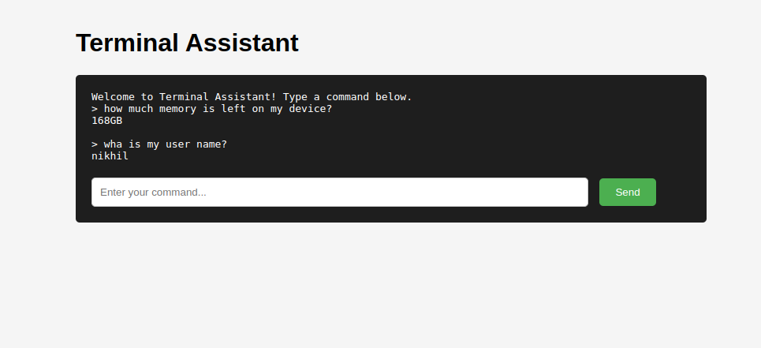

# Terminal GPT Assistant 🤖

<div align="center">
  
</div>

A natural language terminal assistant that converts English commands into Linux operations. Simply type what you want to do in plain English, and the assistant will execute the appropriate terminal commands.

## ✨ Key Features

- 🗣️ Natural language command interpretation
- 🛠️ Automatic Linux command execution
- 🔒 Built-in safety checks for dangerous commands
- 💻 Dual interface: Web UI and CLI
- 📝 Detailed command explanations

## 📋 Requirements

- Python 3.10 or higher
- OpenAI API key
- Linux/Unix environment

## 💻 Running the Assistant

### Option 1: Web Interface

```bash
python app.py
```
Then open your browser and visit: `http://127.0.0.1:5001`

### Option 2: Command Line Interface
```bash
# Interactive mode
python cli.py -i

# Single command mode
python cli.py "show system memory usage"
```

## 📝 Example Commands

Try these natural language commands:

```bash
# System Information
"How much memory is left on my device?"
"What's my username?"
"Show system uptime"

# File Operations
"List all files in the current directory"
"Create a new folder called projects"
"Find all PDF files in downloads folder"

# Process Management
"Show me all running processes"
"What's using the most CPU right now?"
```

## 🔍 Testing

To verify your setup is working:
```bash
python test_openai.py
```
This will test your API key and connection to OpenAI.

## 📁 Project Structure

```
Terminal_GPT_Assistant/
├── app.py                    # Web interface using Flask
├── cli.py                    # Command line interface
├── langchain_tools_and_agents.py  # Core assistant logic
├── test_openai.py           # API connection tests
├── templates/
│   └── index.html          # Web interface template
├── requirements.txt        # Python dependencies
├── .env.example           # Example environment file
└── .env                   # Your API key (not in git)
```

## ⚠️ Important Notes

1. Keep your `.env` file secure and never commit it to git
2. The assistant has safety checks for dangerous commands
3. Web interface runs on port 5001 by default

## 🔧 Troubleshooting

### Common Issues:

1. **API Key Error**
   ```
   Error: OpenAI API key not found
   Solution: Check your .env file has the correct API key
   ```

2. **Port Already in Use**
   ```
   Error: Address already in use
   Solution: Change the port in app.py or stop the process using port 5001
   ```

3. **Module Not Found**
   ```
   Error: No module named 'langchain'
   Solution: Activate virtual environment and run: pip install -r requirements.txt
   ```

## 🛠️ Built With

- OpenAI GPT-3.5
- LangChain
- Flask
- Python 3.10+

## 🌟 Features

- Natural language command interpretation
- Web and CLI interfaces
- Real-time command execution
- Detailed command explanations
